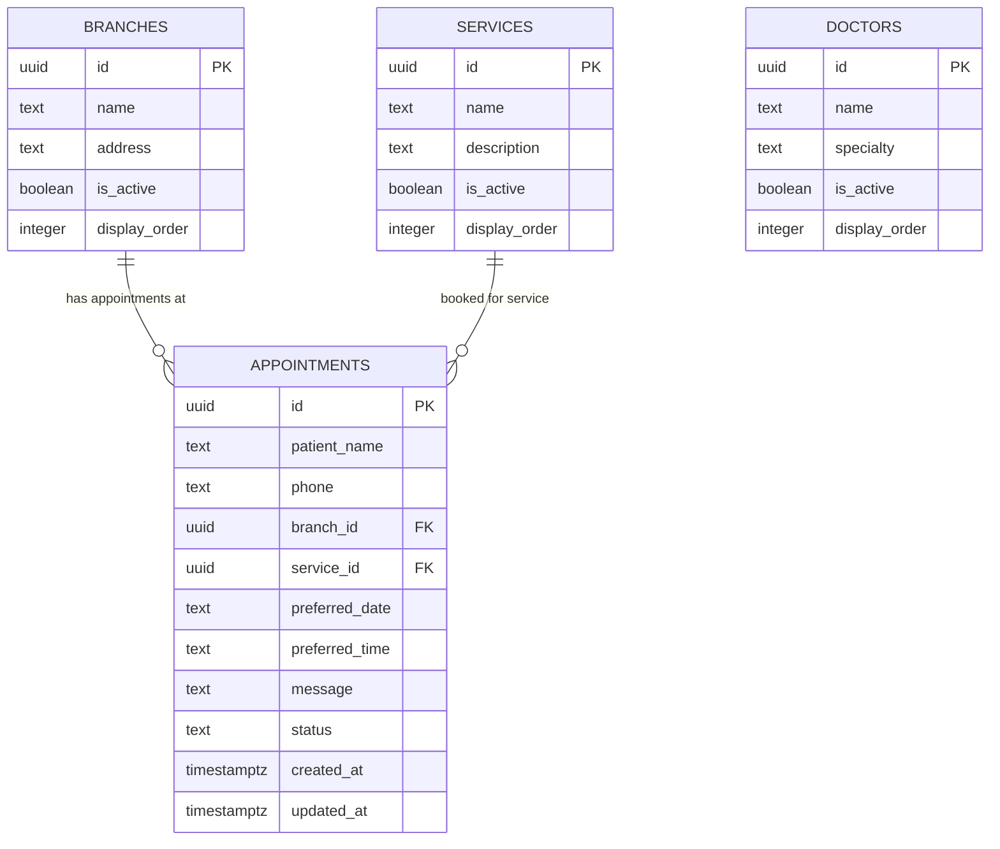

# Smile Dentos — Supabase Database & Security Handover

This document is prepared for the **Smile Dentos Supabase Administrator / Database Custodian**. It outlines the required database tables, relationships, authorization rules, and Row-Level Security (RLS) policies needed for the production website and staff portal.

---

## 1. Database Architecture Overview

The Smile Dentos application utilizes four primary tables in the `public` PostgreSQL schema:



---

## 2. Table Specifications

### A. `public.branches`
* `id` (`uuid`, Primary Key, default `gen_random_uuid()`)
* `name` (`text`, Not Null)
* `address` (`text`, Nullable)
* `phone` (`text`, Nullable)
* `emergency_phone` (`text`, Nullable)
* `opening_hours` (`text`, Nullable)
* `image_url` (`text`, Nullable)
* `maps_url` (`text`, Nullable)
* `display_order` (`integer`, default `0`)
* `is_active` (`boolean`, default `true`)
* `created_at` (`timestamptz`, default `now()`)
* `updated_at` (`timestamptz`, default `now()`)

### B. `public.doctors`
* `id` (`uuid`, Primary Key, default `gen_random_uuid()`)
* `name` (`text`, Not Null)
* `qualification` (`text`, Nullable)
* `specialty` (`text`, Nullable)
* `bio` (`text`, Nullable)
* `image_url` (`text`, Nullable)
* `display_order` (`integer`, default `0`)
* `is_active` (`boolean`, default `true`) — *Represents clinical presence / availability*
* `created_at` (`timestamptz`, default `now()`)
* `updated_at` (`timestamptz`, default `now()`)

### C. `public.services`
* `id` (`uuid`, Primary Key, default `gen_random_uuid()`)
* `name` (`text`, Not Null)
* `description` (`text`, Nullable)
* `image_url` (`text`, Nullable)
* `display_order` (`integer`, default `0`)
* `is_active` (`boolean`, default `true`)
* `created_at` (`timestamptz`, default `now()`)
* `updated_at` (`timestamptz`, default `now()`)

### D. `public.appointments`
* `id` (`uuid`, Primary Key, default `gen_random_uuid()`)
* `patient_name` (`text`, Not Null) — Max 60 characters
* `phone` (`text`, Not Null) — 10 to 13 digits
* `branch_id` (`uuid`, Foreign Key references `public.branches(id)`, Not Null)
* `service_id` (`uuid`, Foreign Key references `public.services(id)`, Not Null)
* `preferred_date` (`text`, Not Null) — Format: `YYYY-MM-DD`
* `preferred_time` (`text`, Nullable, default `'10:00 AM'`)
* `message` (`text`, Nullable) — Holds consultation notes and selected doctor
* `status` (`text`, Not Null, default `'pending'`) — Allowed: `'pending'`, `'confirmed'`, `'completed'`, `'cancelled'`
* `created_at` (`timestamptz`, default `now()`)
* `updated_at` (`timestamptz`, default `now()`)

---

## 3. Security & Access Model

The security boundary is strictly enforced at the database level using Row-Level Security:

1. **Anonymous / Public Patients:**
   - **Can:** Submit (INSERT) new appointment requests through the booking modal.
   - **Can:** Read (SELECT) active branches, doctors, and services for website display.
   - **Cannot:** Read (SELECT), modify (UPDATE), or delete (DELETE) any appointment records.

2. **Authenticated Clinic Administrator:**
   - Identified by Supabase Auth with custom claim in `raw_app_meta_data`: `{"role": "admin"}`.
   - Designated administrator account: `smiledentos@gmail.com`.
   - **Can:** Read (SELECT) all appointment records in the queue.
   - **Can:** Update (UPDATE) appointment statuses (`pending` -> `confirmed` -> `completed` / `cancelled`).
   - **Can:** Update (UPDATE) branch availability and doctor presence toggles.

---

## 4. Idempotent SQL Migration Script

Run the following SQL script in the **Supabase Dashboard &rarr; SQL Editor**:

```sql
-- 1. Enable Row Level Security on all core tables
ALTER TABLE public.branches ENABLE ROW LEVEL SECURITY;
ALTER TABLE public.doctors ENABLE ROW LEVEL SECURITY;
ALTER TABLE public.services ENABLE ROW LEVEL SECURITY;
ALTER TABLE public.appointments ENABLE ROW LEVEL SECURITY;

-- 2. Drop existing conflicting policies if re-running
DROP POLICY IF EXISTS "Public can view active branches" ON public.branches;
DROP POLICY IF EXISTS "Admins can update branches" ON public.branches;
DROP POLICY IF EXISTS "Public can view doctors" ON public.doctors;
DROP POLICY IF EXISTS "Admins can update doctors" ON public.doctors;
DROP POLICY IF EXISTS "Public can view services" ON public.services;
DROP POLICY IF EXISTS "Public can submit appointments" ON public.appointments;
DROP POLICY IF EXISTS "Admins can view appointments" ON public.appointments;
DROP POLICY IF EXISTS "Admins can update appointments" ON public.appointments;

-- 3. Branch Policies
-- Allow anyone to read branches
CREATE POLICY "Public can view active branches"
  ON public.branches
  FOR SELECT
  TO anon, authenticated
  USING (true);

-- Allow authenticated admin to update branch status
CREATE POLICY "Admins can update branches"
  ON public.branches
  FOR UPDATE
  TO authenticated
  USING (
    coalesce((auth.jwt() -> 'app_metadata' ->> 'role'), '') = 'admin'
  )
  WITH CHECK (
    coalesce((auth.jwt() -> 'app_metadata' ->> 'role'), '') = 'admin'
  );

-- 4. Doctor Policies
-- Allow anyone to view doctor profiles and presence
CREATE POLICY "Public can view doctors"
  ON public.doctors
  FOR SELECT
  TO anon, authenticated
  USING (true);

-- Allow authenticated admin to update doctor presence
CREATE POLICY "Admins can update doctors"
  ON public.doctors
  FOR UPDATE
  TO authenticated
  USING (
    coalesce((auth.jwt() -> 'app_metadata' ->> 'role'), '') = 'admin'
  )
  WITH CHECK (
    coalesce((auth.jwt() -> 'app_metadata' ->> 'role'), '') = 'admin'
  );

-- 5. Service Policies
-- Allow anyone to view clinic services
CREATE POLICY "Public can view services"
  ON public.services
  FOR SELECT
  TO anon, authenticated
  USING (true);

-- 6. Appointment Policies
-- A. Public anonymous users can ONLY insert appointments
CREATE POLICY "Public can submit appointments"
  ON public.appointments
  FOR INSERT
  TO anon, authenticated
  WITH CHECK (
    char_length(patient_name) > 0
    AND char_length(patient_name) <= 60
    AND char_length(phone) >= 10
    AND char_length(phone) <= 20
    AND status = 'pending'
  );

-- B. Only authenticated administrator can SELECT appointments
CREATE POLICY "Admins can view appointments"
  ON public.appointments
  FOR SELECT
  TO authenticated
  USING (
    coalesce((auth.jwt() -> 'app_metadata' ->> 'role'), '') = 'admin'
  );

-- C. Only authenticated administrator can UPDATE appointment status
CREATE POLICY "Admins can update appointments"
  ON public.appointments
  FOR UPDATE
  TO authenticated
  USING (
    coalesce((auth.jwt() -> 'app_metadata' ->> 'role'), '') = 'admin'
  )
  WITH CHECK (
    coalesce((auth.jwt() -> 'app_metadata' ->> 'role'), '') = 'admin'
  );
```

---

## 5. Setting Up the Administrator Role in Supabase

To grant administrator rights to the designated clinic email (`smiledentos@gmail.com`), execute this SQL command in the Supabase SQL editor:

```sql
UPDATE auth.users
SET raw_app_meta_data = raw_app_meta_data || '{"role": "admin"}'::jsonb
WHERE email = 'smiledentos@gmail.com';
```

*(Note: If the user does not exist yet, invite or create the user in **Authentication &rarr; Users**, then run the SQL statement above.)*

---

## 6. Verification Checklist for Supabase Administrator

1. [ ] Log in to Supabase Dashboard.
2. [ ] Open **Table Editor** and verify `branches`, `doctors`, `services`, and `appointments` tables exist.
3. [ ] Run the SQL migration in **SQL Editor**.
4. [ ] Ensure `smiledentos@gmail.com` has `{"role": "admin"}` in `raw_app_meta_data`.
5. [ ] Verify that public users CANNOT query appointments via the REST API without an admin JWT.
